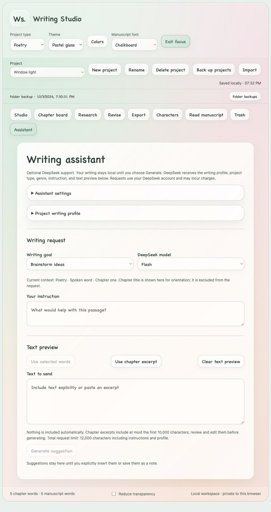
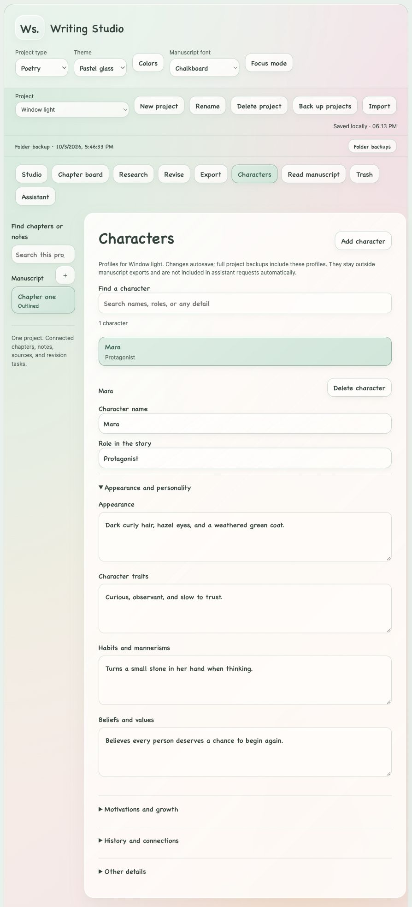

# Writing Studio

Writing Studio is a private writing workspace for fiction, nonfiction, memoir, poetry, screenplays, essays, and academic work. It runs in your browser on your computer, with gentle mint, peach, and rosy pink glass, Chalkboard style headings, and light and dark grey themes. Writing, revision tools, local backups, and exports work without an account or internet connection. An optional DeepSeek assistant uses your own API key when you choose to enable it.

Version **0.3.1-beta** includes Mac and Windows launchers and a portable single-file edition. The Windows package is prepared and its platform logic has been checked, but it has not yet been run on an actual Windows computer.

[Source repository](https://github.com/AuroraX98/Writing-Studio) · [Version 0.3.1-beta downloads](https://github.com/AuroraX98/Writing-Studio/tree/main/downloads)

Download: [Windows ZIP](https://github.com/AuroraX98/Writing-Studio/raw/refs/heads/main/downloads/Writing-Studio-0.3.1-beta-windows.zip) · [Mac ZIP](https://github.com/AuroraX98/Writing-Studio/raw/refs/heads/main/downloads/Writing-Studio-0.3.1-beta-mac.zip) · [Source ZIP](https://github.com/AuroraX98/Writing-Studio/raw/refs/heads/main/downloads/Writing-Studio-0.3.1-beta-source.zip)





## Open the app

Extract the entire download into a folder first. On Windows, double-click **Open Writing Studio.bat**. On Mac, double-click **Open Writing Studio.command**. The launcher opens your browser at **http://127.0.0.1:8766/**. Keep the launch window open while writing and use the same browser and address each time.

**Python 3.8 or newer must be installed for the launcher and automatic folder backups.** The Mac launcher finds Python on your PATH. The Windows launcher checks `py -3`, `python`, and `python3`. If Python is unavailable, open **Writing Studio.html** in a current browser and use downloaded JSON backups. Do not remove the `app` folder when using a launcher.

The standalone HTML edition stores its workspace in browser storage. Storage for files opened directly from your computer varies by browser; moving or renaming the file may create a different workspace. Keep it in the same location, use the same browser, and download backups frequently. Use **Import** to move projects between browsers or computers.

The font selector includes Chalkboard, existing serif and modern options, and Georgia, Palatino, Garamond, Times New Roman, Courier New, Trebuchet, and Verdana. These choices change draft and in-app reading text. Fonts use local system fallbacks, so their exact appearance varies by computer; exports keep their book typography.

**Colors** opens an optional live color preview. Enable custom colors, choose a solid background or a three-color soft gradient, and adjust hue, intensity, brightness, and gradient direction. Writing panels adapt to your selected light or dark theme for readability. **Save colors** keeps your choices; Cancel or Escape restores the previous palette. **Restore original colors** previews the original theme without changing your other settings.

## Write and organize

Subtle dividers and rounded fields make writing sections, assistant controls, and notes easier to scan.

Choose **New project**, enter a name, and select Fiction, Nonfiction, Memoir, Poetry, Screenplay, Essays, or Academic. Add chapters with the **＋** button. The chapter board supports reordering and flexible structure guidance for 42 genres and approaches across those seven project types. All use the same chapter-based workspace, with prompts suited to the selected type. Add guide prompts to your editable outline, then adapt them to your book. Chapter hints start hidden; **Show chapter hints** brings them into view when you want guidance, and **Hide chapter hints** returns to a calmer draft.

Drafts, titles, notes, ideas, saved passages, outlines, research records, and revision tasks autosave after a half-second pause. The browser save indicator reports success or failure. Ordinary closing flushes pending browser changes; check the indicators before closing. A second window changing the same browser workspace pauses saving to protect it.

Select words in the draft and click **Bold** or **Italic**. Formatting appears in **Formatted chapter preview**, whole manuscript reading, and formatted exports; the typing area displays plain text. Each chapter remembers its left, right, or justified alignment and Compact, Comfortable, or Double line spacing. **Undo** and **Redo** handle draft edits and formatting during the current session. Save a version for a lasting milestone.

**Personal dictionary** protects your names and unusual words from the app's typing corrections. It also lets you restore removed words. Browser spelling underlines use your browser's own dictionary. The bundled English typing help offers a small list of common typo corrections, including `Ca n` → `Can`; ambiguous word boundaries appear as suggestions. It is not a complete spelling dictionary. Use **Undo correction** to immediately reverse a correction.

**Offline thesaurus** uses the locally bundled WordNet 3.0 English word database. Select a word to explore synonyms grouped by meaning and part of speech, then choose a replacement yourself. Replacements preserve selected formatting and can be undone. Coverage varies by word; definitions and part-of-speech groups help you judge whether a synonym suits your sentence. It does not interpret the context for you, and it makes no external runtime requests.

**Delete** moves chapters, notes, ideas, saved passages, outlines, tasks, research records, character profiles, versions, and projects to **Trash**. Restore brings them back; permanent deletion asks for confirmation. The last chapter is replaced by a blank chapter so writing can continue.

## Keep character profiles

Open **Characters** to keep a separate collection for each project. Add a name and role, then describe appearance, traits, habits, beliefs, goals, fears, relationships, backstory, character arc, and notes. Search works across names, roles, and all profile details. Edits autosave, and deleted profiles move to Trash for recovery.

Full JSON backups include character profiles. Manuscript exports keep chapter text and exclude these private profiles. Character information is not sent to the assistant automatically; include it explicitly in the text preview only when you want it used in a request.

## Revise and read

**Revise → Find and replace** searches a chapter or the whole manuscript, with case and whole-word options. Preview the matches before applying changes. Applying saves a version of every affected chapter first. If the manuscript changed after previewing, create a new preview.

**Save a version** captures the chapter's text, formatting, alignment, spacing, and notes. **Compare with current draft** shows added and removed wording. Large comparisons may show whole changed blocks or shortened displays; the complete versions stay saved. Restoring a version first preserves the draft it replaces.

**Read manuscript** displays all chapters in order, with a chapter jump list and buttons to return to editing. Private notes and research do not appear in this reading view or manuscript exports.

| Shortcut | Action |
| --- | --- |
| Ctrl/Cmd+B or Ctrl/Cmd+I | Bold or italic selected draft text |
| Ctrl/Cmd+Z | Undo draft edit |
| Ctrl/Cmd+Shift+Z; Ctrl+Y | Redo draft edit |
| Ctrl/Cmd+S | Save current changes |
| Ctrl/Cmd+Shift+F | Open find and replace |
| Ctrl/Cmd+Shift+R | Read the manuscript |

## Keep recoverable copies

Browser storage is the working copy. Clearing browser data removes it, and a full disk or browser storage limit can prevent saving. The app reports failures and keeps a previous valid browser copy when possible. A backup is an additional copy; keep one on another drive for protection against a lost or damaged computer.

With the launcher running, **Folder backups** saves complete project JSON copies outside browser storage. The separate folder indicator shows the last successful backup and any failure. By default, copies go to:

- Windows: `%LOCALAPPDATA%\Writing Studio\Backups`
- Mac: `~/Library/Application Support/Writing Studio/Backups`
- Linux when running Python directly: `~/.local/share/writing-studio/backups`

If the new Writing Studio folder does not exist and an older Writing Desk backup folder is present, the launcher reuses that older folder. Existing copies stay in place; the app does not move or delete them during the rename. The folder shown in the app is the folder actually in use.

`latest.json` updates after edits are saved. `previous.json` retains the preceding changed copy. Dated recovery snapshots are written on the first changed save and when at least five minutes have passed since the last snapshot; this is an edit-driven schedule, so idle time does not create extra copies. **Back up now** forces a dated copy. The newest 50 dated snapshots are kept, in addition to latest and previous. Writes use temporary files and atomic replacement.

If an existing folder copy differs from the browser's workspace, automatic folder saving pauses until you choose **Import latest backup** or **Use this workspace**. Importing adds separate project copies. A stale window cannot silently replace a newer folder backup; use the visible recovery controls when a conflict occurs. The app never automatically replaces the browser workspace with a disk copy.

**Back up projects** downloads a JSON file containing every project, character profiles, notes, research, versions, dictionary, and Trash. **Import** restores JSON backups as separate copies, or imports TXT and Markdown source as a chapter. Markdown import retains its source text rather than converting its formatting. Research URLs are saved references; keep excerpts in your records for offline reading.

To choose a different backup folder or local address, run Python directly:

```text
python3 launch.py --backup-dir "/path/to/your/backup-folder" --port 8767
```

On Windows, use `py -3` and a Windows folder path instead of `python3`. Changing the port changes the browser storage address; import a backup to transfer your workspace. Close an old launcher before starting the updated app.

## Export your manuscript

**Export** offers PDF, Word (.docx), Markdown (.md), TXT (.txt), and a standalone HTML reading copy. Chapter titles and draft text follow manuscript order; private notes and character profiles remain in full JSON backups.

Word, PDF, and HTML preserve bold, italic, alignment, and line spacing. Markdown includes bold and italic markup, but visual alignment and line spacing depend on the reader. TXT preserves words and paragraph breaks without formatting. Direct PDF includes a bundled serif font, page numbers, wrapping, and chapter page breaks. If a character is outside that font, the app reports it; use **Print / save as PDF** for browser font support.

## Optional DeepSeek assistant

The assistant requires the local launcher, your own DeepSeek API key, an internet connection, and any usage charges from your provider. Choose a goal such as brainstorming, outlining, continuation, rewriting, or feedback. Each project can save a writing profile: tone, point of view, English variant, style, audience, and preferences. Review the instruction and **Text to send** before choosing **Generate suggestion**. Text is included only when you select it, choose a chapter excerpt, or paste it; private notes and project titles are excluded. Generate sends the profile, project type, genre, instruction, and previewed text to DeepSeek.

Suggestions stay in an editable review area until you explicitly save them as a chapter note, replace selected words, or append them to the chapter. Insertion preserves a saved version first. If the draft, project type, genre, or writing profile changes after generating, create a new suggestion before inserting. The core writing tools continue to work offline.

Manual key attachment keeps the key in launcher memory for that session. Closing the launcher clears that in-memory copy. You can also opt in to reading a private local key file, using the setup described in **KEY_FILE_SETUP.md**. The file is plain JSON on your computer and stays outside the app folder by default, beside the backup folder. Protect access to your computer and keep the private key file out of GitHub. API keys are excluded from project backups and release downloads; the distributed example is blank. The controls are under **Assistant → Assistant settings → Saved API key file**. Create a blank private file, fill it locally, then select **Allow Writing Studio to read this key file** or **Reload saved key** if it is already enabled. Reading a saved key requires your explicit setting; it is not enabled by default. **Disconnect** forgets the in-memory key and disables automatic file reading while leaving the file in place. **Remove saved key** empties the configured file, disables reading, and forgets the in-memory key. You can also clear its `apiKey` value manually. The assistant is optional and disabled until configured. Manual **Attach key** turns off automatic file reading. Attaching a key only sets up the local session; it makes no provider request and does not verify account credit. An actual live DeepSeek request has not been verified in this build without a user key.

## Build and check the source

The source download includes generated runtime files and their build inputs. To regenerate `app/index.html`, `app/main.js`, `app/styles.css`, and `Writing Studio.html`, run:

```text
python3 work/build_app.py
```

The WordNet data is already bundled, so ordinary builds need no downloads. To regenerate that data, `work/build_thesaurus.py` takes the WordNet 3.0 database archive, full archive for word exceptions, and license file downloaded separately by the developer. Its help and source list the inputs and their official URLs. The script itself makes no network calls, and the writing app never downloads thesaurus data at runtime.

Run checks from the project folder with Python 3.8+ and Node.js available:

```text
node --test tests/storage.test.cjs
node tests/export.test.cjs
node tests/pdf.test.cjs
node tests/revision.test.cjs
node tests/text-tools.test.cjs
node tests/local-backup.test.cjs
node tests/thesaurus.test.cjs
node --test tests/theme-palette.test.cjs
node --test tests/genres.test.cjs
node tests/assistant.test.cjs
python3 -m unittest discover -s tests -p test_local_backup.py -v
python3 -m unittest discover -s tests -p test_ai_proxy.py -v
python3 -m unittest discover -s tests -p test_key_file.py -v
```

Checks cover storage and recovery, invalid imports, Trash, formatted exports, alignment, replacement previews, stale previews, version comparisons, formatting edits, dictionary storage, backup conflicts, atomic writes, retention, and local request boundaries. Backups in these tests use temporary folders and sample text. PDF checks require Python for structural inspection. Loopback server tests require permission to bind a local address. Assistant checks use mocked provider responses and need no real API key; `tests/mock_ai_server.py` is a development-only browser test launcher.

After rebuilding, create curated downloads with:

```text
python3 work/package_release.py
```

The packaging script checks archive integrity and excludes working backups and scratch files. Downloads include the selected app preview above. The script does not upload anything to GitHub.

## Current limits and licensing

This is a beta browser app with launch scripts, rather than an installed desktop application. Nested scenes, attached research files, anchored comments, DOCX import, EPUB, full offline spelling dictionaries, and cross-device synchronization are future work. Undo history is per session; saved versions and JSON backups are persistent. Keep a backup before updating, and import it when moving to a new browser or address.

The bundled PDF font's license is in `app/vendor/DejaVu-LICENSE.txt`; the English thesaurus data license is in `app/vendor/WordNet-LICENSE.txt`. A license for the application source has not been selected yet. The public repository does not currently grant an open-source license for the application; the bundled font and WordNet data retain their separate licenses.
